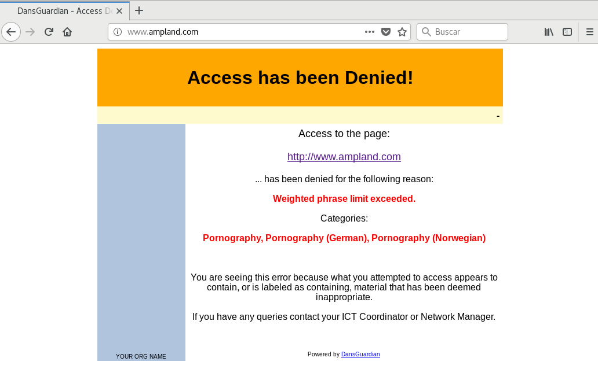

Instalar DANSGUARDIAN en CentOS 7
====================================

DANSGUARDIAN es considerado con un filtro de contenido de sitios web muy potente que trabaja conjuntamente con SQUID. Actúa entre el navegador cliente y el proxy, interceptando y modificando la comunicación entre ambos, facilitando así el filtrado de los contenidos de las páginas.

Esta herramienta es de código abierto y está desarrollada en C++, permite una configuración flexible que se adapta a las necesidades del usuario.

DANSGUARDIAN se ejecuta como un demonio independiente del proxy, aceptando peticiones en el puerto 8080 y redirigiéndolas al proxy SQUID, que escucha en el puerto 3128. Esto significa que, cuando una petición entre por el puerto 8080, DANSGUARDIAN la filtra y la pasa a SQUID para ser procesada y/o filtrada. Si el resultado del filtrado es una denegación de acceso a una determinada página web, se muestra al usuario el mensaje correspondiente; de lo contrario, se le da acceso.

Descargamos el archivo .rpm de DANSGUARDIAN, se puede hacer desde la página:

http://rpm.pbone.net/index.php3/stat/4/idpl/30428145/dir/centos_7/com/dansguardian-2.12.0.3-1.1.x86_64.rpm.html

En el apartado que dice::

	ftp.pbone.net dansguardian-2.12.0.3-1.1-x86_64.rpm

Lo instalamos::

	# rpm -ivh dansguardian-2.12.0.3-1.1.x86_64.rpm 
	advertencia:dansguardian-2.12.0.3-1.1.x86_64.rpm: EncabezadoV3 DSA/SHA1 Signature, ID de clave a9d6e8ec: NOKEY
	Preparando...                         ################################# [100%]
	Actualizando / instalando...
	   1:dansguardian-2.12.0.3-1.1        ################################# [100%]

Editar el archivo de configuración y nos vamos a las configuraciones de RED. Vamos a configurar:
* IP por donde atenderar el DANSGUARDIAN las peticiones de los clientes.
* Puerto donde atenderar el DANSGUARDIAN las peticiones de los clientes.
* El proxyip que es la IP en donde esta el Squid.
* Y el proxyport que es la puerto en donde esta el Squid.

	# vi /etc/dansguardian/dansguardian.conf

	# Network Settings
	#
	# the IP that DansGuardian listens on.  If left blank DansGuardian will
	# listen on all IPs.  That would include all NICs, loopback, modem, etc.
	# Normally you would have your firewall protecting this, but if you want
	# you can limit it to a certain IP. To bind to multiple interfaces,
	# specify each IP on an individual filterip line.
	# You can have the same IP twice so long as it has a different port.
	filterip = 192.168.1.230

	# the ports that DansGuardian listens to.  Specify one line per filterip
	# line.  You can specify different authentication mechanisms per port but
	# only if the mechanisms can co-exist (e.g. basic/proxy auth can't)
	filterports = 8080
	#filterports = 8081

	# the ip of the proxy (default is the loopback - i.e. this server)
	proxyip = 127.0.0.1

	# the port DansGuardian connects to proxy on
	proxyport = 3128

Ahora procedemos ejecutar el binario de DANSGUARDIAN, sería una buena idea crearle un script para systemd::

	# dansguardian 

Consultamos los puertos y debe estar el 8080 de DANSGUARDIAN y el 3128 del squid::

	# netstat -natp | grep -i listen
	tcp        0      0 192.168.1.230:8080      0.0.0.0:*               LISTEN      2294/dansguardian   
	tcp        0      0 0.0.0.0:22              0.0.0.0:*               LISTEN      886/sshd            
	tcp        0      0 127.0.0.1:25            0.0.0.0:*               LISTEN      1009/master         
	tcp6       0      0 :::3306                 :::*                    LISTEN      933/mysqld          
	tcp6       0      0 :::80                   :::*                    LISTEN      1538/httpd          
	tcp6       0      0 :::22                   :::*                    LISTEN      886/sshd            
	tcp6       0      0 :::3128                 :::*                    LISTEN      2203/(squid-1)      
	tcp6       0      0 ::1:25                  :::*                    LISTEN      1009/master  

Con los pasos anteriores ya tenemos configurado DANSGUARDIAN con Squid, los cuales por defecto filtran contenido relacionado con pornografía, páginas de drogas, entre otros. Vamos al cliente y hacemos una prueba con alguna pagina de pornografía.

Si deseamos hacer un filtrado con campos específicos, modificamos el archivo /etc/dansguardian/list/bannedphraselist y dentro de éste, se agregan las palabras o frases que deseemos bloquear; en este caso estaremos bloqueando el contenido que se relacione con las palabras: oso, perro, cartera.::

	# vi /etc/dansguardian/list/bannedphraselist
	<sex>,<xxx>,<porno>,<4chan>
	<oso>,< oso >,< oso>,<oso >,<osos>,< osos >,< osos>,<osos >
	<perro>,< perro >,<perro >,< perro>

Debemos asegurarnos en el archivo de configuración tener las siguientes lineas, ojo no todas seguramente las utilizamos.::

	bannedphraselist = '/etc/dansguardian/list/bannedphraselist'
	exceptionphraselist = '/etc/dansguardian/list/exceptionphraselist'
	weightedphraselist = '/etc/dansguardian/list/weightedphraselist'
	bannedsitelist = '/etc/dansguardian/list/bannedsitelist'
	exceptionsitelist = '/etc/dansguardian/list/exceptionsitelist'
	exceptionurllist = '/etc/dansguardian/list/exceptionurllist'
	bannedurllist = '/etc/dansguardian/list/bannedurllist'
	bannedregexpurllist = '/etc/dansguardian/list/bannedregexpurllist'
	bannedextensionlist = '/etc/dansguardian/list/bannedextensionlist'
	bannedmimetypelist = '/etc/dansguardian/list/bannedmimetypelist'
	bannediplist = '/etc/dansguardian/list/bannediplist'
	exceptioniplist = '/etc/dansguardian/list/exceptioniplist'
	banneduserlist = '/etc/dansguardian/list/banneduserlist'
	exceptionuserlist = '/etc/dansguardian/list/exceptionuserlist'
	picsfile = '/etc/dansguardian/list/pics'

Detenemos el DANSGUARDIAN y lo iniciamos nuevamente::

	# ps -ef | grep dansguardian | grep -w 1
	dansgua+  2517     1  0 23:01 ?        00:00:00 dansguardian
	root      2561  1276  0 23:04 pts/1    00:00:00 grep --color=auto dansguardian
	# kill -15 2517

	# dansguardian

